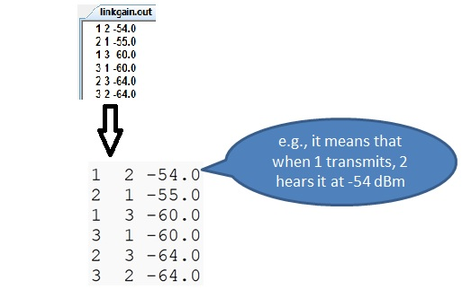
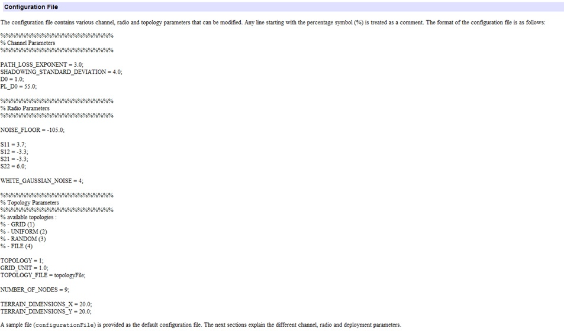
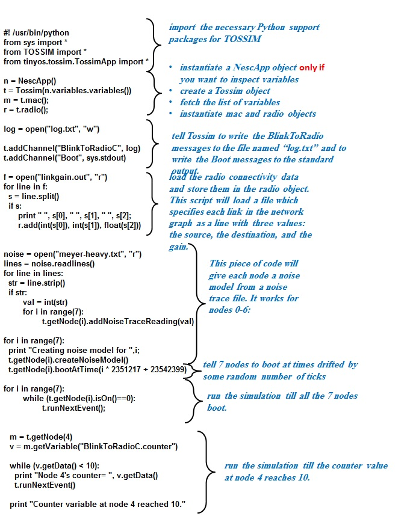

# Scalable-Broadcast-Algorithm
Implementing SBA (Scalable Broadcast Algorithm) Protocol with TinyOs


## Steps to run with TOSSIM

**Step1:** Compiling nesC intended program by issuing the following command in directory and resolving all syntax errors.
To compile TOSSIM, you have to pass the sim option to make: (it is not necessary to say that a Makefile should already exists) 

```
Terminal Prompt (Shell) >> make micaz sim
```

**Step2:** TOSSIM allows you to specify a network topology in terms of gain. Create a file linkgain.out that looks like this: 



TOSSIM also simulates the RF noise and interference a node hears, both from other nodes as well as outside sources. It uses the Closest Pattern Matching (CPM) algorithm. CPM takes a noise trace as input and generates a statistical model from it. (meyer-heavy.txt)

TOSSIM has a tool for the option of generating a network topology using a theoretical propagation model. The tool is written in Java and is 	
	net.tinyos.sim.LinkLayetModel
The tool takes a single command line parameter, the name of a configuration file, e.g.: 
	java net.tinyos.sim. LinkLayetModel config.txt 
The format of a configuration file is beyond the scope of this presentation! the tool has its own documentation:
http://www.tinyos.net/tinyos-2.x/doc/html/tutorial/usc-topologies.html


### Tossim’s Java-based LinkLayerModel tool for topology generation

TOSSIM has a tool for the option of generating a network topology using a theoretical propagation model. The tool is written in Java and is
```
	net.tinyos.sim.LinkLayetModel
```
The tool takes a single command line parameter, the name of a configuration file, e.g.: 
```	
 java net.tinyos.sim. LinkLayetModel config.txt 
```
The format of a configuration file is beyond the scope of this project! the tool has its own documentation:
[http://www.tinyos.net/tinyos-2.x/doc/html/tutorial/usc-topologies.html](http://www.tinyos.net/tinyos-2.x/doc/html/tutorial/usc-topologies.html)




**Step3:** writing a python script and saving it with name test.py : 


**Step4:** Running the python script with this command 

```
Terminal prompt >> python test.py
```

